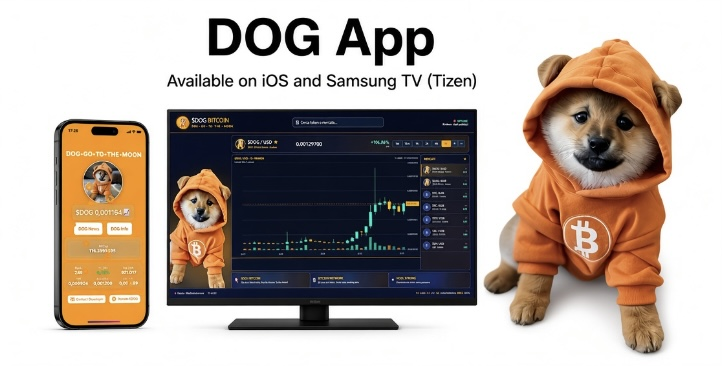

## Preview

# 🐕 $DOG Tracker

Official repository for **$DOG Tracker** (iPhone) and **$DOGTV** (Samsung/Tizen).

## Downloads

### 📱 $DOG Tracker — iPhone
- Bundle ID: `it.lk.dogtracker`
- Version: `1.0`
- Build: `3`
- Minimum iOS: `14.4`

[Download DOGTracker.ipa](https://github.com/userspacetec/-DOG-DECENTRALIZED-APPs/releases/latest/download/DOGTracker.ipa)

Install with [AltStore](https://altstore.io)
or with [Sideloadly](https://sideloadly.io) 
all 2 app require to activate developer mode for open the app
Usage:
Open TradingView Chart by Tap price and Tap DOG News for last news and DOG Info by the website [doggotothemoon.io](https://doggotothemoon.io) ( Thanks ❤️ to the team of doggotothemoon.io) 

### 📺 $DOGTV — Samsung/Tizen
- File: `DOGTV.wgt`
- Version: `1`
- Build: none

[Download DOGTV.wgt](https://github.com/userspacetec/-DOG-DECENTRALIZED-APPs/releases/latest/download/DOGTV.wgt)

Install with **[Apps2Samsung](https://apps2samsung.com)** with Developer Mode enabled.
A navigation system in focus (highlighted with orange halo) on everything that is interactive: search bar, the 6 timeframe buttons, each market in the list, the first  app on TV with candlestick . 

Usage:
◄►▲▼ move the focus on zone and zoom, OK/Send confirmation/, Back🔙 exit zones/exits typing/exit app 

⸻

📥 Required Tools

🍎 iOS — AltStore

To install and sideload the iOS application, you can use AltStore or Sideloadly

👉 Download [AltStore](https://altstore.io)

👉 Download [Sidestore](https://sideloadly.io)

AltStore is an independent sideloading platform for iOS. Please download AltStore only from its official website.

Disclaimer:
This project is not affiliated with, endorsed by, sponsored by, or associated with AltStore LLC or Apple Inc.
AltStore is a third-party application used for sideloading.
Please refer to the official AltStore documentation for installation requirements and supported devices.

⸻

📺 Samsung / Tizen — Apps2Samsung

For Samsung Smart TVs and Tizen devices, you can use Apps2Samsung to sideload compatible applications.

👉 Download [Apps2Samsung](https://apps2samsung.com)

👉 Github [Apps2Samsung](https://github.com/Apps2Samsung/Apps2Samsung) 

Apps2Samsung is a free and open-source tool that uses Samsung’s developer/sideloading mechanism to install applications on compatible Samsung TVs and Tizen devices.

⸻

⚠️ Disclaimer:
This project is not affiliated with, endorsed by, sponsored by, or associated with Samsung Electronics Co., Ltd.
Apps2Samsung is an independent open-source project and does not modify or jailbreak Samsung TV firmware.
Samsung, Tizen and related trademarks belong to their respective owners.

The tools mentioned above are third-party software and are not part of this project.

This project does not distribute, modify, or claim ownership of AltStore, Apps2Samsung, Apple, Samsung, or Tizen.

Users are responsible for complying with the terms of service, software licenses, device requirements, and applicable laws when using third-party sideloading tools.

Use these tools at your own risk.

⸻

❤️ Community & Inspiration

This project is an independent community-driven project created solely for the $DOG / Bitcoin community.

I am not affiliated with, associated with, endorsed by, sponsored by, or officially connected to any company, organization, developer, project, collection, or individual mentioned throughout this repository, unless explicitly stated otherwise.

The applications and tools created here are made for the community, by the community, with the goal of experimenting, creating, and contributing something useful and enjoyable to the Bitcoin ecosystem.

⸻

🪨 Special Thanks

A special ❤️ THANK YOU to [@LeonidasNFT](https://x.com/leonidasnft) for the Runestone and $DOG Airdrop received and [@rodarmor](https://x.com/rodarmor) for made it possibile on block 840.000 launched the Runes protocol, introducing a new fungible-token protocol for Bitcoin and helping establish the broader Runes ecosystem.

The launch was intentionally aligned with Bitcoin’s fourth halving, making block 840,000 a significant milestone for both Bitcoin and the Runes community.

I am deeply grateful for the opportunity to be part of this ecosystem and for the inspiration it continues to provide.

This project is deeply inspired by [@LeonidasNFT](https://x.com/leonidasnft) on X and his work, vision, and contribution to the Ordinals, Runes and Bitcoin community.

Thank you to everyone building, creating, and supporting the community. 🧡

Built independently.
Inspired by Bitcoin.
Made for the $DOG community. 🐕₿
